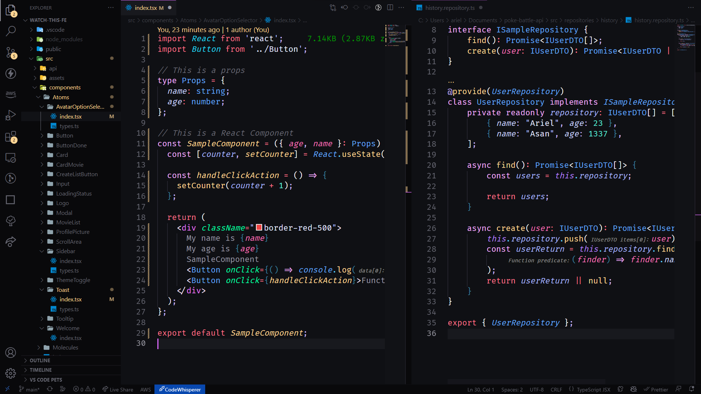

# Asan VS Code theme
``` TypeScript
// An aggressive theme for aggressive software engineers
```
### React | Node with [ExpressoTS](https://github.com/expressots/expressots)


## Install

1. Go to [VS Marketplace](https://marketplace.visualstudio.com/items?itemName=arielbetti.asan-theme).
2. Click on the "Install" button.
3. Then [select a theme](https://code.visualstudio.com/docs/getstarted/themes#_selecting-the-color-theme).

## Override this theme

To override this (or any other) theme in your personal config file, please follow the guide in the [color theme](https://code.visualstudio.com/api/extension-guides/color-theme) documentation. This is handy for small tweaks to the theme without having to fork and maintain your own theme.

## Contribute

1. Clone and open this [repo](https://github.com/ArielBetti/asan-theme) in VS Code
2. Run `yarn` to install the dependencies.
3. Press `F5` to open a new window with your extension loaded
4. Open `Code > Preferences > Color Theme` [`⌘k ⌘t`] and pick the "asaN theme ..." theme you want to test. Note: It seems this has to be done 2x because the first time it switches back to the default theme. This might be a bug?
5. Make changes to the /src/themes files.
    - **UI**: For all changes to the "outer UI", like (status bar, file navigation etc.), take a look at the [Theme Color](https://code.visualstudio.com/api/references/theme-color) reference.
    - **Syntax**: For changes to the "code highlighting", examine the syntax scopes by invoking the [`Developer: Inspect Editor Tokens and Scopes`](https://code.visualstudio.com/api/language-extensions/syntax-highlight-guide#scope-inspector) command from the Command Palette (`Ctrl+Shift+P` or `Cmd+Shift+P` on Mac) in the Extension Development Host window.
6. Run `yarn build` to update the theme. You can also run `yarn start` instead to automatically rebuild the theme while making changes and no reloading should be necessary.
7. Once you're happy, commit your changes and open a PR.
